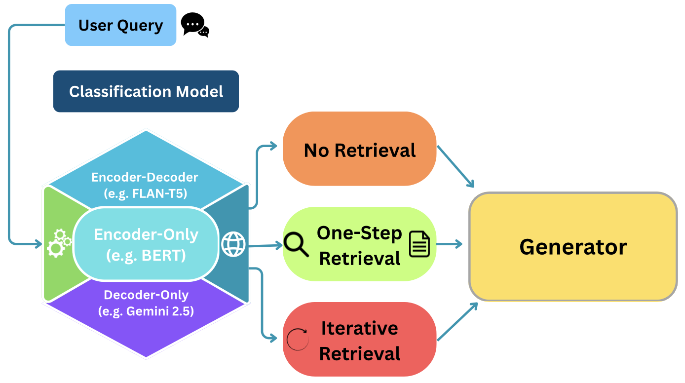

# Rethinking Query Complexity for Adaptive RAG: Architectural Comparison and Beyond



Official implementation for **"Rethinking Query Complexity for Adaptive RAG: Architectural Comparison and Beyond"** by Abdullah Bezir (2025).

This repository extends the original [Adaptive-RAG](https://arxiv.org/pdf/2403.14403.pdf) framework with methodological and architectural evaluations, including an optimized labeling strategy and detailed comparison of encoder-only, encoder-decoder, and decoder-only architectures for query complexity classification.

## 🔬 Research Contributions

### 1. **Optimized Labeling Methodology**
- **Significant efficiency improvement** in training data generation
- Leverages dataset inductive biases instead of exhaustive strategy execution
- Enables processing of larger datasets for robust training

### 2. **Comprehensive Architectural Comparison**
- **BERT-Large** vs **FLAN-T5-Large** performance evaluation
- **Zero-shot LLM classification** using generator models
- **Verification mechanism** with LLM-based prediction refinement

### 3. **Enhanced Evaluation Framework**
- **LLM-as-judge** semantic evaluation replacing exact string matching
- Cross-model compatibility with modern LLM generators
- Comprehensive benchmarking across multiple datasets

### 🎯 **Key Finding**: BERT-Large achieves competitive performance with **fewer parameters** than FLAN-T5-Large, demonstrating that architectural alignment with task requirements is more important than parameter count.

---

## 🚀 Quick Start

### Environment Setup
```bash
# Create conda environment
conda create -n adaptiverag python=3.8
conda activate adaptiverag

# Install dependencies
pip install torch==1.13.1+cu117 --extra-index-url https://download.pytorch.org/whl/cu117
pip install -r requirements.txt

# Set up API keys
export GOOGLE_API_KEY="your-google-api-key"
```

### Infrastructure Setup
```bash
# 1. Start Elasticsearch (Port 9200)
wget https://artifacts.elastic.co/downloads/elasticsearch/elasticsearch-8.15.1-linux-x86_64.tar.gz
tar -xzf elasticsearch-8.15.1-linux-x86_64.tar.gz
cd elasticsearch-8.15.1/
./bin/elasticsearch &

# 2. Start Retriever Server (Port 8000)
uvicorn serve:app --port 8000 --app-dir retriever_server &
```

---

## 📊 Dataset Preparation

### Option 1: Download Pre-processed Data (Recommended)
```bash
# Download pre-processed datasets (1.5GB compressed) 
wget "https://huggingface.co/datasets/bezir/AdaptiveRAGQueryComplexity/resolve/main/processed_data.tar.gz" -O processed_data.tar.gz

# Extract datasets
tar -xzf processed_data.tar.gz

# Build retrieval indices
python retriever_server/build_index.py wiki
python retriever_server/build_index.py hotpotqa
python retriever_server/build_index.py 2wikimultihopqa
python retriever_server/build_index.py musique
```


## 🔬 Reproduction Pipeline

### 1. Generate Optimized Labels
Our key contribution - **significantly more efficient** than the original exhaustive labeling: (or use labeled HF dataset available bezir/AdaptiveRAGQueryComplexity)

```bash
# Generate optimized labels using dataset inductive biases
bash scaled_silver_labeling/shell_scripts/run_master_labeling.sh \
    --model gemini-2.5-flash-lite \
    --strategy optimized \
    --dataset all

# Compare with original strategy (for validation)
bash scaled_silver_labeling/shell_scripts/run_master_labeling.sh \
    --model gemini-2.5-flash-lite \
    --strategy original \
    --dataset hotpotqa
```

### 2. Train Classifiers (All Architectures)

```bash
# Train all classifier architectures
bash classifier/run/train_master.sh

# This trains:
# - BERT-Large classifier (best performance)
# - FLAN-T5-Large classifier (comparison)
# - Both optimized and original labeling strategies
```

### 3. Run Architectural Comparison Study

```bash
# Run comprehensive evaluation across all architectures
bash adaptive_rag_benchmark/scripts/run_experiments_nohup.sh
```

**Individual Experiment Examples:**

```bash
# BERT + Optimized Strategy
python adaptive_rag_parallel.py \
    --classifier_path classifier/models/bert_classifier_optimized.pt \
    --model gemini-2.5-flash-lite \
    --dataset hotpotqa

# LLM Self-Classification (Zero-Shot)
python adaptive_rag_parallel.py \
    --classification_llm \
    --model gemini-2.5-flash-lite \
    --dataset hotpotqa

# Fixed Strategy Baselines
python adaptive_rag_parallel.py --force nor --model gemini-2.5-flash-lite --dataset hotpotqa
python adaptive_rag_parallel.py --force oner --model gemini-2.5-flash-lite --dataset hotpotqa
python adaptive_rag_parallel.py --force ircot --model gemini-2.5-flash-lite --dataset hotpotqa
```

### 4. Verification Mechanism 
Enable upgrade-only verification (A→B, A→C, B→C):

```bash
python adaptive_rag_parallel.py \
    --classifier_path classifier/models/bert_classifier_optimized.pt \
    --model gemini-2.5-flash-lite \
    --dataset hotpotqa \
    --verify_classification
```

---

## 📈 Key Research Findings

### Architecture Performance
- **BERT-Large**: Best downstream performance with fewer parameters
- **FLAN-T5-Large**: Higher parameter count, competitive classification accuracy
- **LLM Self-Classification**: Shows overconfidence, leads to insufficient retrieval

---


## 🔍 Troubleshooting

**Elasticsearch Issues**
```bash
# Check status and restart if needed
curl localhost:9200/_cat/indices
pkill -f elasticsearch && cd elasticsearch-8.15.1/ && ./bin/elasticsearch &
```

**Memory Issues**
```bash
# Reduce batch size and workers for limited memory
python adaptive_rag_parallel.py --batch_size 8 --workers 2 --model gemini-2.5-flash-lite
```

**API Rate Limiting**
```bash
# Add delays and retry logic
python adaptive_rag_parallel.py --api_delay 0.5 --timeout 60 --retry_attempts 3
```

---

## 📚 Repository Structure

```
Adaptive-RAG/
├── README.md                          # This file (updated for new research)
├── adaptive_rag_parallel.py           # Main experimental script
├── scaled_silver_labeling/            # Optimized labeling system
│   ├── scripts/run_unified_labeling.py   # Main labeling script
│   └── shell_scripts/run_master_labeling.sh # Master labeling workflow
├── classifier/                        # Multi-architecture classifiers
│   ├── run/train_master.sh           # Training workflow
│   └── models/                       # Trained classifier models
├── adaptive_rag_benchmark/            # Comprehensive experiments
│   └── scripts/run_experiments_nohup.sh  # Full experimental pipeline
├── analysis/                          # Analysis and visualization tools
├── retriever_server/                  # BM25 retrieval backend
├── processing_scripts/               # Dataset processing
├── download/                         # Dataset download scripts
└── results/                          # Experimental results and outputs
```

---

## 🎯 Quick Reproduction Commands

```bash
# 1. Setup datasets and infrastructure (see above sections)
# 2. Generate optimized labels
bash scaled_silver_labeling/shell_scripts/run_master_labeling.sh --model gemini-2.5-flash-lite --strategy optimized --dataset all

# 3. Train all classifiers
bash classifier/run/train_master.sh

# 4. Run comprehensive experiments
bash adaptive_rag_benchmark/scripts/run_experiments_nohup.sh
```

**Quick Validation**
```bash
# Test key findings on sample dataset
python adaptive_rag_parallel.py --classification_llm --model gemini-2.5-flash-lite --dataset hotpotqa
python adaptive_rag_parallel.py --force ircot --model gemini-2.5-flash-lite --dataset hotpotqa
python adaptive_rag_parallel.py --force nor --model gemini-2.5-flash-lite --dataset hotpotqa
```

---

## 🤖 AI Assistance Acknowledgment

We are transitioning into an AI-powered world where AI is a part of research, academia, work and in general everything. Using AI for enhancing academic work and scientific knowledge with integration is a crucial part of conducting research in this new era.

Throughout the experiments and implementation of this study, **Claude-4-sonnet** and **Cursor** were used as helpful tools to support and speed up the implementation and documentation processes by aligning the **University of Glasgow's guidelines** for responsible AI use in academic work. The models and tools assisted with code development for experimental framework setup, technical documentation formatting, and repository organization.

Additionally, **Gemini-2.5-Pro** was used for final grammatical, smoothness and typo checks. However, the models were not used for the writing or knowledge extraction or conclusion deriving purposes.

It is important to stress that all research contributions, theoretical analysis, experiments, and conclusions presented in this study belong to the author.

---

## 📖 Citation

```bibtex
@mastersthesis{bezir2025adaptive,
  author = {Abdullah Bezir},
  title = {Rethinking Query Complexity for Adaptive RAG: Architectural Comparison and Beyond},
  school = {University of Glasgow},
  year = {2025},
  type = {MSc Dissertation}
}

@inproceedings{jeong2024adaptiverag,
  title = {Adaptive-RAG: Learning to Adapt Retrieval-Augmented Large Language Models through Question Complexity},
  author = {Soyeong Jeong and Jinheon Baek and Sukmin Cho and Sung Ju Hwang and Jong Park},
  booktitle = {NAACL},
  year = {2024}
}
```

---

## 🤝 Acknowledgments

- Original [Adaptive-RAG](https://github.com/starsuzi/Adaptive-RAG) framework by Jeong et al.
- [IRCoT](https://github.com/StonyBrookNLP/ircot) for multi-hop reasoning baseline

---

## 📧 Contact

For questions about reproduction or research details:
- **Author**: Abdullah Bezir
- **Institution**: University of Glasgow

**Dataset and Results**: Available at 🤗 [HuggingFace: AdaptiveRAGQueryComplexity](https://huggingface.co/datasets/bezir/AdaptiveRAGQueryComplexity)
